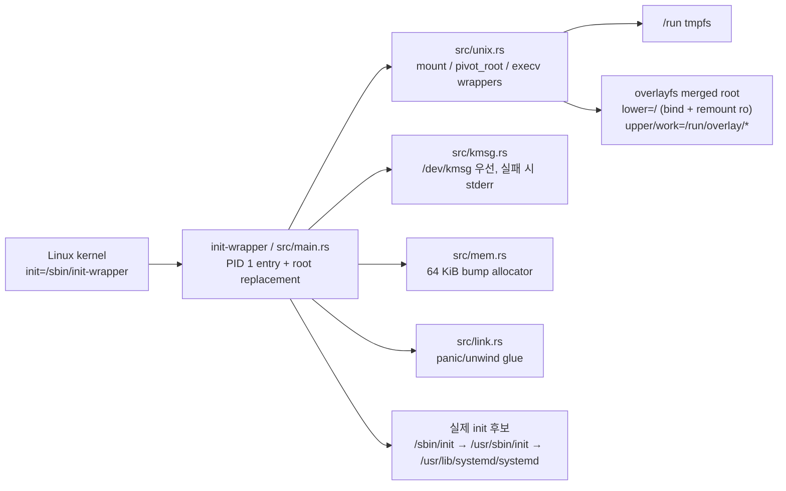
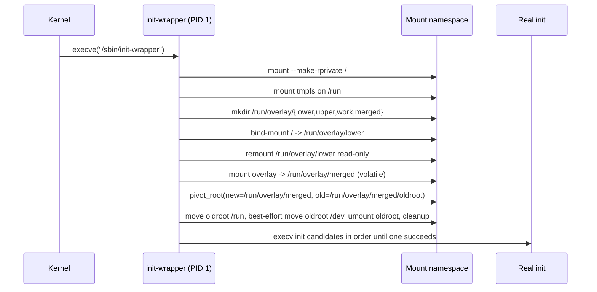

# init-wrapper

`init-wrapper`는 Linux 커널이 `init=`로 직접 실행하는 매우 작은 early-boot용 PID 1 래퍼입니다. 기존 루트 파일시스템을 lower로 bind mount한 뒤 표준 remount 단계로 읽기 전용화하고, `/run` 위의 tmpfs를 upper/work로 사용하는 `overlayfs` 루트로 전환한 뒤 실제 init 바이너리에 제어를 넘깁니다.

이 저장소의 목적은 **부팅 초기에 루트 전체를 휘발성 쓰기 계층으로 감싸는 것**입니다. 코드가 하는 일은 `src/main.rs`의 실제 syscall 흐름이 기준이며, 아래 설명도 그 구현을 따라갑니다.

## 언제 쓰나

- 커널 부팅 시점에 `init=/sbin/init-wrapper`로 가장 먼저 실행할 PID 1이 필요할 때
- 디스크의 원본 루트는 보존하고, 런타임 쓰기는 RAM 기반의 임시 overlay upper/work에만 쌓고 싶을 때
- 실제 init(`/sbin/init` 등)를 실행하기 전에 `pivot_root`로 루트 전체를 교체해야 할 때

## 핵심 동작

1. `/`를 `MS_REC | MS_PRIVATE`로 다시 마운트해 하위 mount까지 recursive private로 만들고 mount propagation을 끊습니다.
2. `/run`에 tmpfs를 마운트합니다.
3. `/run/overlay/{lower,upper,work,merged}` 디렉터리를 만듭니다.
4. 현재 `/`를 `/run/overlay/lower`에 bind mount 합니다.
5. 바로 이어 표준 bind remount 단계(`MS_BIND | MS_REMOUNT | MS_RDONLY`)로 `/run/overlay/lower`를 읽기 전용화합니다.
6. `lowerdir=/run/overlay/lower`, `upperdir=/run/overlay/upper`, `workdir=/run/overlay/work`로 overlayfs를 `/run/overlay/merged`에 마운트합니다.
   - overlay 옵션에는 `redirect_dir=on`, `uuid=on`, `metacopy=on`, `volatile`이 포함됩니다.
   - `upper`와 `work`가 `/run` tmpfs 아래에 있으므로 쓰기 내용은 메모리 기반이며 재부팅 후 사라집니다.
7. `pivot_root`로 새 overlay 루트를 활성화하고 기존 루트를 `/oldroot` 아래로 보냅니다.
8. `/oldroot/run`은 새 루트의 `/run`으로 옮기고, `/oldroot/dev`는 가능하면 새 루트의 `/dev`로 옮깁니다. `/dev` 이동 실패는 early-boot 환경 차이를 고려해 best-effort로 무시합니다.
9. `/oldroot`를 lazy unmount 하고 임시 디렉터리를 정리합니다.
10. 다음 init 후보를 순서대로 `execv` 합니다.
   - `/sbin/init`
   - `/usr/sbin/init`
   - `/usr/lib/systemd/systemd`
11. 후보 실행이 `ENOENT`, `EACCES`, `ENOEXEC`, `ENOTDIR`로 실패하면 다음 후보를 시도하고, 그 외 오류는 즉시 실패로 종료합니다.

## 구성 요소



## 부팅 시퀀스



## 사용 방법

커널 커맨드라인에 다음을 추가합니다.

```text
init=/sbin/init-wrapper
```

일반적으로는 빌드한 바이너리를 대상 루트 또는 initramfs 안의 `/sbin/init-wrapper`에 배치해야 합니다.

## 실행 전제조건

- **권한**: 사실상 privileged early boot 환경이 필요합니다. 보통 PID 1로 실행되며 `mount`, `pivot_root`, `umount`, `execv`가 가능한 권한이 있어야 합니다.
- **커널 기능**: tmpfs, overlayfs, bind mount, `pivot_root`, mount namespace 동작이 필요합니다.
- **overlay 옵션 호환성**: 특히 `volatile`, `metacopy`, `redirect_dir`, `uuid` 옵션은 커널/배포판 조합에 따라 실패할 수 있습니다.
- **실제 init 존재**: `/sbin/init`, `/usr/sbin/init`, `/usr/lib/systemd/systemd` 중 최소 하나는 실행 가능해야 합니다.

## 런타임 리스크와 주의사항

- **지속성 없음**: upper/work가 `/run` tmpfs 아래에 있으므로 루트에 대한 런타임 쓰기는 모두 휘발성입니다. 재부팅하거나 전원이 꺼지면 사라집니다.
- **메모리 압박**: 쓰기량이 많으면 tmpfs가 메모리를 소비합니다. 메모리 부족 시 부팅 후 프로세스가 불안정해질 수 있습니다.
- **부팅 실패 가능성**: overlay mount, `pivot_root`, init hand-off 중 하나라도 실패하면 시스템이 바로 다음 단계로 넘어가지 못합니다.
- **실행 시점 민감성**: 이 바이너리는 일반 사용자 공간 도구가 아닙니다. 이미 운영 중인 시스템에서 임의 실행하면 현재 mount topology를 깨뜨릴 수 있습니다.
- **로그 가시성 차이**: `/dev/kmsg`를 열 수 있으면 커널 로그로 남기고, 아니면 stderr로만 출력합니다.

## 빌드 노트

- `cargo build --release`만 실행하면 기본 산출물은 `target/release/init-wrapper`입니다.
- 저장소의 `cargo/config.toml`은 Cargo가 자동으로 읽는 기본 위치가 아닙니다. 운영자가 이를 `.cargo/config.toml`로 복사/이름변경하거나 `--target aarch64-unknown-linux-musl`를 명시했을 때만 산출물 경로가 `target/aarch64-unknown-linux-musl/release/init-wrapper`로 바뀝니다.
- 이 프로젝트는 `#![no_std]`, `#![no_main]`, `panic = "abort"` 구성을 사용합니다.
- `rust-toolchain.toml`은 개발/검증용 Rust toolchain을 `1.96.0`으로 고정합니다.
- 기본 빌드는 overlay mount 실패 시 즉시 실패하는 엄격 모드입니다. 커널 호환성이 더 중요하면 `--features compat-overlay`로 `volatile` 제거 옵션과 최소 lower/upper/work 옵션을 순서대로 재시도할 수 있습니다.
- `Dockerfile`, `Dockerfile.debian`이 포함되어 있어 컨테이너 안에서 release 빌드를 재현할 수 있습니다.
- 실제 배포 전에는 대상 커널/루트 파일시스템 조합에서 init 후보 경로와 overlay 옵션 호환성을 따로 확인하는 편이 안전합니다.

## 검증 한계

- 이 저장소에는 privileged early-boot 전체를 자동으로 재현하는 테스트 하네스가 없습니다.
- 따라서 문서 검토만으로는 실제 커널의 overlayfs 옵션 지원 여부, `pivot_root` 성공 여부, init hand-off 성공을 증명할 수 없습니다.
- 안전한 검증은 disposable VM 또는 테스트용 initramfs에서 `init=/sbin/init-wrapper`로 직접 부팅해 확인해야 합니다.
- 현재 QEMU/KVM disposable boot smoke 결과는 [`docs/artifacts/current-qemu-boot-smoke.md`](docs/artifacts/current-qemu-boot-smoke.md)에 기록되어 있습니다.
- user-namespace smoke 시도와 한계는 [`docs/artifacts/current-userns-smoke-attempt.md`](docs/artifacts/current-userns-smoke-attempt.md)에 별도로 기록되어 있습니다.
